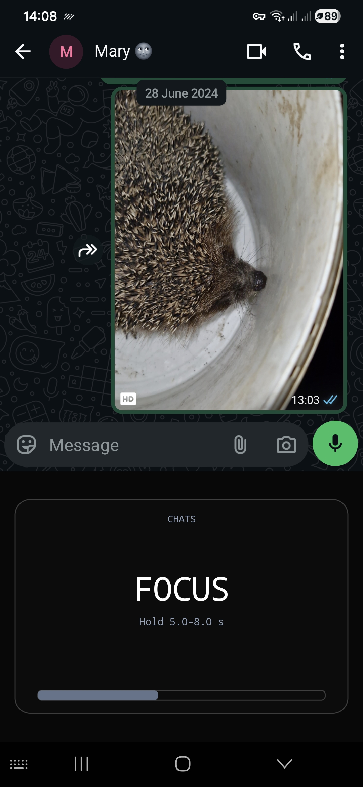
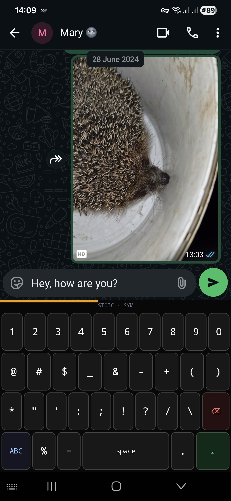
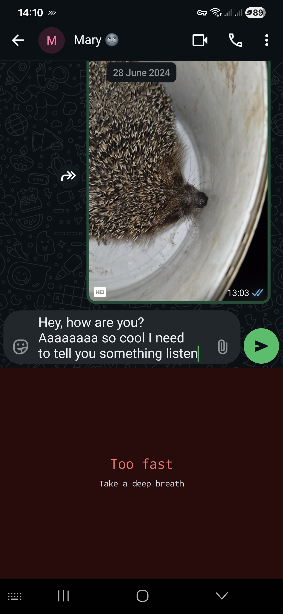
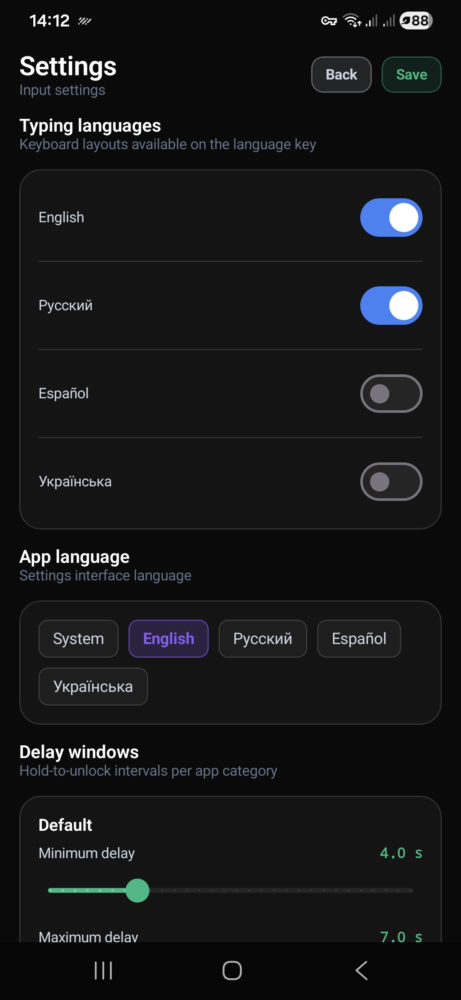
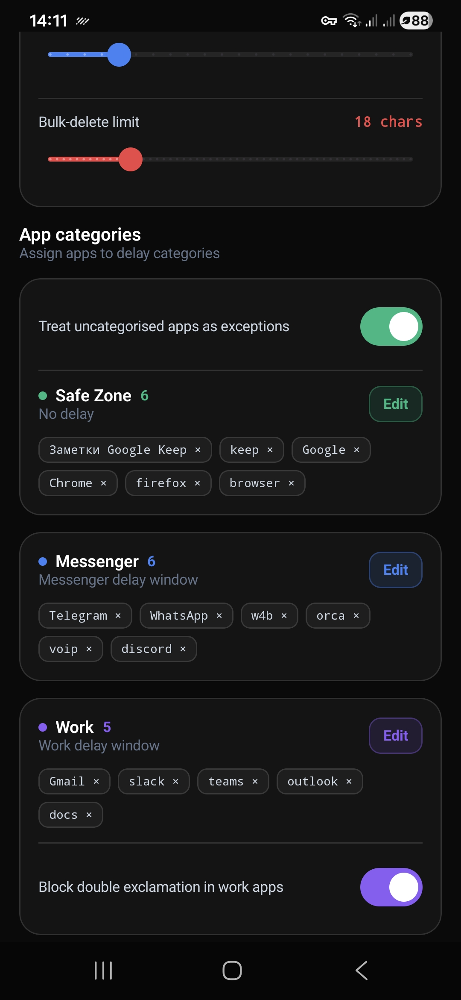

<p align="center">
  
</p>

<h1 align="center">StoicBoard</h1>

<p align="center">
  Lightweight Android keyboard designed for mindful typing and reducing impulsive communication
</p>

<p align="center">
  
  
  
  
  
</p>

## Key Features

* **Hold-to-Unlock Delays:** Imposes a customizable hold-to-unlock delay interval before the keyboard activates. Delays can be configured based on the category of the active application (e.g., Messenger, Work, or Safe Zone).
* **Speed Monitoring (Heat Control):** Tracks typing speed (APM) and temporarily locks the keyboard if the user types too quickly.
* **Deletion Guard:** Restricts continuous backspace usage after a certain threshold of characters has been typed, preventing impulsive text deletion.
* **Offline Operation:** The application does not request the `INTERNET` permission. All input processing and configuration state are handled strictly on the device.
* **Supported Layouts:** QWERTY layouts for English, Russian, Spanish, and Ukrainian.

## Project Structure

```text
├── .gitignore
├── README.md
├── PRIVACY_POLICY.md
├── Screenshots/
│   ├── 1.jpg
│   ├── ...
│   └── 5.jpg
└── StoicBoard/              # Android project directory
    ├── build.gradle.kts
    ├── settings.gradle.kts
    └── app/
```

## Requirements

* Android 8.0 (API level 26) or higher.
* Built using Jetpack Compose for the settings interface and standard XML/Canvas views for the Input Method Service.

## Development and Build

Import the `StoicBoard` folder into Android Studio and build the project using Gradle.

To assemble the release build via CLI:
```bash
cd StoicBoard
./gradlew assembleRelease
```

## License

This project is licensed under the MIT License - see the [LICENSE](LICENSE) file for details.